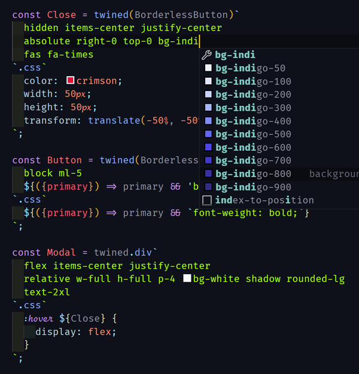

# vscode-twined-components

Syntax highlighting and IntelliSense for [twined-components](https://github.com/lowfront/twined-components).

## Usage

The twined-components extension adds highlighting and IntelliSense for twined-component template strings in JavaScript and TypeScript.
